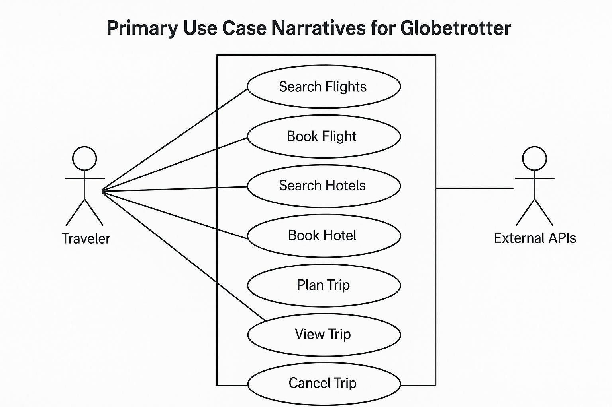

# Globetrotter

## System Name

Globetrotter

## Contributors

sharanggupta - [https://github.com/sharanggupta](https://github.com/sharanggupta)

## License

MIT License

## Background Context

This is a TDD Sandbox Project to simulate legacy code and practice test-driven development.  Learn more at [Optivem Journal](https://optivem.com/journal) and from [Valentina Jemuović](https://www.linkedin.com/in/valentina-jemuovic/).

## Use Cases

*   Search Flights
*   Search Hotels
*   Plan Trip
*   Book Flights
*   Book Hotels
*   View Trip
*   Cancel Trip

## External Systems

*   Flight API (e.g., Kiwi.com API - Free tier available)
*   Hotel API (e.g., TripAdvisor API - Free tier available)
*   Weather API (e.g., OpenWeatherMap API - Free tier available)
*   Points of Interest API (e.g., Foursquare Places API - Free tier available)
*   System Clock

## Tech Stack

*   Programming Language: Java
*   Framework: Spring Boot
*   Databases: PostgreSQL (per microservice)
*   Message Broker: RabbitMQ

## System Architecture Style

Frontend + Microservice Backend

## Architecture Diagram

[Embed Architecture Diagram Here]

**Components:**

*   Frontend
*   Flight Service
*   Hotel Service
*   Weather Service
*   POI Service

**External Systems:**

*   Kiwi.com API
*   TripAdvisor API
*   OpenWeatherMap API
*   Foursquare Places API
*   System Clock

## Repository Strategy

Mono-Repo approach

## Branching Strategy

Feature Branching

## Deployment Model

Linode shared CPU 2GB cluster

## Component Repositories

Since we are using a Mono-Repo approach, all components will reside in this repository.

## Project Boards

We will use GitHub Projects for managing tasks and issues. [https://github.com/users/sharanggupta/projects/1]

## Tickets

Create tickets in the Project Board for the User Stories. Examples:

*   Search Flights
*   Search Hotels
*   Plan Trip
*   Book Flights
*   Book Hotels
*   View Trip
*   Cancel Trip

## Use Cases

🎭 Actors

**Primary Actors:**

*   Traveler – interacts with the system to plan, book, and manage trips.

**Secondary Actors:**

*   External APIs – includes Kiwi.com, TripAdvisor, OpenWeatherMap, Foursquare Places.
*   System Clock – used for time-sensitive operations like scheduling and validation.

✅ Detailed Use Case Narratives

1.  **Search Flights**

    *   Actors: Traveler
    *   Preconditions: User has internet access and provides travel input.
    *   Basic Flow:
        *   Traveler enters origin, destination, and travel dates.
        *   System sends query to Kiwi.com API.
        *   Displays matching flights.
    *   Alternative Flows:
        *   No flights returned → show "No results" message.
        *   API failure → show error and retry option.
    *   Postconditions: Flights are shown or failure message logged.
2.  **Book Flight**

    *   Actors: Traveler
    *   Preconditions: A flight must be selected.
    *   Basic Flow:
        *   Traveler clicks "Book".
        *   System checks availability via API.
        *   Saves booking and confirms.
    *   Exceptional Flows:
        *   Flight unavailable → prompt re-selection.
        *   API/payment error → show failure.
    *   Postconditions: Booking confirmed and saved.
3.  **Search Hotels**

    *   Actors: Traveler
    *   Preconditions: Destination and dates provided.
    *   Basic Flow:
        *   Traveler inputs city and dates.
        *   System queries TripAdvisor API.
        *   Displays hotel results with filters.
    *   Alternative Flows:
        *   No hotels found → show message.
        *   API error → show retry option.
4.  **Book Hotel**

    *   Actors: Traveler
    *   Preconditions: Hotel is selected.
    *   Basic Flow:
        *   Traveler clicks “Book Hotel”.
        *   System confirms with API.
        *   Saves booking and confirms.
5.  **Plan Trip**

    *   Actors: Traveler
    *   Preconditions: User logged in.
    *   Basic Flow:
        *   Traveler combines flight, hotel, POIs.
        *   System creates and stores trip object.
        *   Trip shown in "My Trips".
6.  **View Trip**

    *   Actors: Traveler
    *   Basic Flow:
        *   Traveler visits "My Trips".
        *   System retrieves and displays trip details including weather and POIs.
7.  **Cancel Trip**

    *   Actors: Traveler
    *   Preconditions: Trip must exist and be eligible for cancellation.
    *   Basic Flow:
        *   Traveler clicks “Cancel”.
        *   System sends cancel requests to Flight/Hotel APIs.
        *   Updates status and notifies user.

        
🖼️ Use Case Diagram: 

Primary actor (Traveler) interacts with the system use cases, which internally call secondary actors (APIs, System Clock).

## Tickets

Create tickets in the Project Board for the User Stories. Examples:

*   Search Flights
*   Search Hotels
*   Plan Trip
*   Book Flights
*   Book Hotels
*   View Trip
*   Cancel Trip

## Environments

*   UAT Environment
*   Production Environment

## Automated CI/CD Pipeline

We will set up an automated CI/CD pipeline using GitHub Actions to build, test, and deploy the application to the UAT and Production environments.

## Developer Setup

1.  Install Docker and Docker Compose.
2.  Configure the application using Docker Compose.
